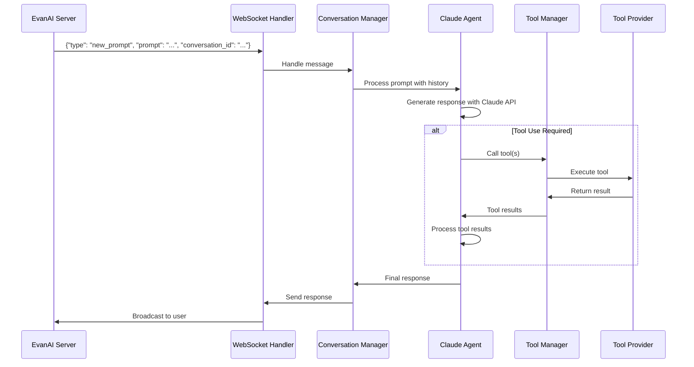

# EvanAI Client

A sophisticated AI agent client that connects to the EvanAI server via WebSocket, processes natural language prompts using Claude API, and provides an extensible plugin system for custom tools. This client acts as an intelligent assistant capable of performing various tasks through its modular tool architecture while maintaining conversation context and persistent state.

## Features

- 🔌 **Real-time WebSocket Connection**: Maintains persistent connection to EvanAI server for instant communication
- 🤖 **Claude API Integration**: Leverages Anthropic's Claude models for intelligent, context-aware responses
- 🔧 **Extensible Tool System**: Plugin-based architecture allowing easy addition of custom tools
- 💾 **Dual-Level State Management**: Separate global and per-conversation state persistence
- 🎯 **Multi-Conversation Support**: Handle multiple independent conversation contexts simultaneously
- 🛠️ **Parallel Tool Execution**: Support for multiple tool calls in a single Claude response
- 📁 **Sandboxed File System**: Each conversation gets its own working directory with organized structure
- 🔄 **Auto-Reconnection**: Automatic WebSocket reconnection with configurable retry delays
- 🎨 **Rich CLI Interface**: Colored terminal output for better readability

## Table of Contents

- [Features](#features)
- [Architecture Overview](#architecture-overview)
- [Installation](#installation)
- [Usage](#usage)
- [Creating Custom Tools](#creating-custom-tools)
- [Advanced Tool Development](#advanced-tool-development)
- [System Architecture](#system-architecture)
- [State Management](#state-management)
- [Runtime Directory Structure](#runtime-directory-structure)
- [Message Protocol](#message-protocol)
- [Configuration](#configuration)
- [Troubleshooting](#troubleshooting)
- [Development](#development)
- [Best Practices](#best-practices)

## Architecture Overview

The EvanAI Client follows a modular architecture with clear separation of concerns:

```
┌─────────────────────────────────────────────────┐
│                  EvanAI Server                  │
│              (WebSocket Endpoint)               │
└────────────────────┬───────────────────────────┘
                     │ WebSocket
                     ↓
┌─────────────────────────────────────────────────┐
│              WebSocket Handler                  │
│         (Connection Management & I/O)           │
└────────────────────┬───────────────────────────┘
                     │
                     ↓
┌─────────────────────────────────────────────────┐
│           Conversation Manager                  │
│    (Routes Messages to Conversations)           │
└────────────────────┬───────────────────────────┘
                     │
          ┌──────────┼──────────┐
          ↓          ↓          ↓
┌──────────────┐ ┌──────────┐ ┌──────────────┐
│Claude Agent │ │Tool Manager│ │State Manager │
│ (AI Brain)  │ │(Tool Exec) │ │(Persistence) │
└──────────────┘ └──────────┘ └──────────────┘
                     │
          ┌──────────┼──────────┐
          ↓          ↓          ↓
    [Weather]   [FileSystem]  [Upload]
    [Math]      [Asset]       [Custom...]
                Tools
```

## Installation

### Prerequisites

- Python 3.8+
- Anthropic API key

### Setup

1. Clone the repository and navigate to the client directory:
```bash
cd evanai-client
```

2. Install dependencies:
```bash
pip install -r requirements.txt
```

3. Install the client in development mode:
```bash
pip install -e .
```

4. Set up your environment variables:
```bash
cp .env.template .env
# Edit .env and add your ANTHROPIC_API_KEY
```

Or export directly:
```bash
export ANTHROPIC_API_KEY='your-api-key-here'
```

## Usage

### Running the Client

Start the client to listen for prompts from the server:

```bash
# Basic usage
evanai-client run

# With options
evanai-client run --reset-state              # Clear all persisted state
evanai-client run --runtime-dir ./custom_dir  # Use custom runtime directory
evanai-client run --model claude-3-opus-20240229  # Use different Claude model
```

### Available Commands

| Command | Description | Example |
|---------|-------------|---------|
| `run` | Start the client and connect to server | `evanai-client run` |
| `status` | Check client status and conversations | `evanai-client status` |
| `runtime-info` | Display runtime directory structure | `evanai-client runtime-info` |
| `reset-persistence` | Reset all persistence data | `evanai-client reset-persistence --force` |
| `debug` | Launch web-based debug interface | `evanai-client debug --port 8069` |
| `test-weather` | Test the weather tool locally | `evanai-client test-weather "London"` |
| `test-prompt` | Test prompt processing locally | `evanai-client test-prompt "Hello!"` |

### Command Options

#### `run` Command Options
- `--reset-state`: Clear all persistence data before starting
- `--runtime-dir PATH`: Specify custom runtime directory (default: `evanai_runtime`)
- `--api-key KEY`: Provide Anthropic API key (can also use env var)
- `--model MODEL`: Specify Claude model to use

#### `reset-persistence` Command Options
- `--force`: Skip confirmation prompt
- `--runtime-dir PATH`: Specify runtime directory to reset

#### `debug` Command Options
- `--port PORT`: Port to run the debug server on (default: 8069)
- `--runtime-dir PATH`: Specify runtime directory

### Real-World Examples

```bash
# Start fresh with no previous state
evanai-client run --reset-state

# Use a development environment
evanai-client run --runtime-dir ./dev_runtime --model claude-3-haiku-20240307

# Check what conversations are active
evanai-client runtime-info

# Test a complex prompt with tools
evanai-client test-prompt "What's the weather in Paris and calculate 15% tip on $85.50"

# Clean up after testing
evanai-client reset-persistence --force

# Launch debug interface for local tool testing
evanai-client debug --port 8069
```

## Creating Custom Tools

Tools are plugins that extend the agent's capabilities, allowing it to perform specialized tasks. The tool system is designed for flexibility, supporting multiple tool calls in a single Claude response and maintaining both global and per-conversation state.

### Tool System Components

1. **BaseToolSetProvider**: Abstract base class for all tool providers
2. **Tool**: Defines a tool's metadata and parameters
3. **Parameter**: Describes individual tool parameters with type validation
4. **ParameterType**: Enum defining supported parameter types (STRING, INTEGER, NUMBER, BOOLEAN, OBJECT, ARRAY)

### Step-by-Step Tool Creation Guide

#### 1. Create the Tool File

Create a new Python file in the `evanai_client/tools/` directory:

```bash
touch evanai_client/tools/my_custom_tool.py
```

#### 2. Import Required Components

```python
from typing import Dict, List, Any, Optional, Tuple
from pathlib import Path
from ..tool_system import BaseToolSetProvider, Tool, Parameter, ParameterType
```

#### 3. Implement the Tool Provider Class

```python
class MyCustomToolProvider(BaseToolSetProvider):
    """Provider for custom functionality."""

    def __init__(self, websocket_handler=None):
        super().__init__(websocket_handler)
        # Initialize any resources your tool needs
        self.config = self._load_config()

    def _load_config(self):
        """Load tool-specific configuration."""
        return {"api_endpoint": "https://api.example.com"}
```

#### 4. Define Tools in the init() Method

The `init()` method must return three components:
1. List of Tool objects
2. Initial global state dictionary
3. Initial per-conversation state dictionary

```python
def init(self) -> Tuple[List[Tool], Dict[str, Any], Dict[str, Dict[str, Any]]]:
    tools = [
        Tool(
            id="fetch_data",  # Unique identifier
            name="Fetch Data",  # Human-readable name
            description="Fetch data from an external API",  # Clear description for Claude
            parameters={
                "query": Parameter(
                    name="query",
                    type=ParameterType.STRING,
                    description="Search query",
                    required=True
                ),
                "limit": Parameter(
                    name="limit",
                    type=ParameterType.INTEGER,
                    description="Maximum results to return",
                    required=False,
                    default=10
                ),
                "filters": Parameter(
                    name="filters",
                    type=ParameterType.OBJECT,
                    description="Optional filters",
                    required=False,
                    properties={
                        "category": Parameter(
                            name="category",
                            type=ParameterType.STRING,
                            description="Filter by category"
                        ),
                        "date_from": Parameter(
                            name="date_from",
                            type=ParameterType.STRING,
                            description="Start date (YYYY-MM-DD)"
                        )
                    }
                )
            },
            returns=Parameter(  # Optional: describe return value
                name="search_results",
                type=ParameterType.ARRAY,
                description="Array of search results"
            )
        )
    ]

    # Global state persists across all conversations
    global_state = {
        "total_api_calls": 0,
        "cache": {},
        "last_cleanup": None
    }

    # Per-conversation state is isolated per conversation
    per_conversation_state = {}

    return tools, global_state, per_conversation_state
```

#### 5. Implement the call_tool() Method

```python
def call_tool(
    self,
    tool_id: str,
    tool_parameters: Dict[str, Any],
    per_conversation_state: Dict[str, Any],
    global_state: Dict[str, Any]
) -> Tuple[Any, Optional[str]]:
    """Execute the requested tool.

    Returns:
        Tuple of (result, error_message)
        - result: Tool output (any JSON-serializable type)
        - error_message: None if successful, error string if failed
    """

    # Access working directory if needed
    working_dir = per_conversation_state.get('_working_directory')

    if tool_id == "fetch_data":
        try:
            # Extract parameters
            query = tool_parameters.get("query")
            limit = tool_parameters.get("limit", 10)
            filters = tool_parameters.get("filters", {})

            # Update global state
            global_state["total_api_calls"] += 1

            # Track in conversation state
            per_conversation_state.setdefault("queries", []).append(query)

            # Check cache
            cache_key = f"{query}:{limit}"
            if cache_key in global_state["cache"]:
                return {"results": global_state["cache"][cache_key], "from_cache": True}, None

            # Perform actual work
            results = self._fetch_from_api(query, limit, filters)

            # Update cache
            global_state["cache"][cache_key] = results

            return {"results": results, "from_cache": False}, None

        except Exception as e:
            return None, f"Error fetching data: {str(e)}"

    return None, f"Unknown tool: {tool_id}"

def _fetch_from_api(self, query: str, limit: int, filters: Dict) -> List[Dict]:
    """Private method for API interaction."""
    # Implementation here
    return [{"id": 1, "title": f"Result for {query}"}]
```

### Complete Example: Advanced Calculator Tool

```python
from typing import Dict, List, Any, Optional, Tuple
import math
import re
from ..tool_system import BaseToolSetProvider, Tool, Parameter, ParameterType

class CalculatorToolProvider(BaseToolSetProvider):
    """Advanced calculator with expression parsing and history."""

    def init(self) -> Tuple[List[Tool], Dict[str, Any], Dict[str, Dict[str, Any]]]:
        tools = [
            Tool(
                id="calculate",
                name="Calculate Expression",
                description="Evaluate mathematical expressions with variables",
                parameters={
                    "expression": Parameter(
                        name="expression",
                        type=ParameterType.STRING,
                        description="Mathematical expression (e.g., '2 + 2', 'sin(pi/2)', 'x^2 where x=5')",
                        required=True
                    ),
                    "variables": Parameter(
                        name="variables",
                        type=ParameterType.OBJECT,
                        description="Variable values for the expression",
                        required=False
                    ),
                    "precision": Parameter(
                        name="precision",
                        type=ParameterType.INTEGER,
                        description="Decimal precision (default: 4)",
                        required=False,
                        default=4
                    )
                }
            ),
            Tool(
                id="get_calculation_history",
                name="Get Calculation History",
                description="Retrieve previous calculations from this conversation",
                parameters={
                    "limit": Parameter(
                        name="limit",
                        type=ParameterType.INTEGER,
                        description="Number of recent calculations to retrieve",
                        required=False,
                        default=5
                    )
                }
            )
        ]

        global_state = {
            "total_calculations": 0,
            "all_time_history": []
        }

        per_conversation_state = {}

        return tools, global_state, per_conversation_state

    def call_tool(
        self,
        tool_id: str,
        tool_parameters: Dict[str, Any],
        per_conversation_state: Dict[str, Any],
        global_state: Dict[str, Any]
    ) -> Tuple[Any, Optional[str]]:

        if tool_id == "calculate":
            return self._calculate(tool_parameters, per_conversation_state, global_state)
        elif tool_id == "get_calculation_history":
            return self._get_history(tool_parameters, per_conversation_state)

        return None, f"Unknown tool: {tool_id}"

    def _calculate(self, params: Dict, conv_state: Dict, global_state: Dict) -> Tuple[Dict, Optional[str]]:
        expression = params.get("expression")
        variables = params.get("variables", {})
        precision = params.get("precision", 4)

        try:
            # Substitute variables
            expr = expression
            for var, val in variables.items():
                expr = expr.replace(var, str(val))

            # Safe evaluation with math functions
            allowed_names = {
                k: v for k, v in math.__dict__.items()
                if not k.startswith("_")
            }
            allowed_names.update({"abs": abs, "round": round})

            # Replace ^ with ** for exponentiation
            expr = expr.replace("^", "**")

            # Evaluate
            result = eval(expr, {"__builtins__": {}}, allowed_names)

            # Round if float
            if isinstance(result, float):
                result = round(result, precision)

            # Update states
            global_state["total_calculations"] += 1

            calculation_record = {
                "expression": expression,
                "variables": variables,
                "result": result
            }

            conv_state.setdefault("history", []).append(calculation_record)
            global_state["all_time_history"].append(calculation_record)

            return {
                "expression": expression,
                "result": result,
                "variables_used": variables
            }, None

        except Exception as e:
            return None, f"Calculation error: {str(e)}"

    def _get_history(self, params: Dict, conv_state: Dict) -> Tuple[List, Optional[str]]:
        limit = params.get("limit", 5)
        history = conv_state.get("history", [])

        return history[-limit:] if history else [], None
```

## Advanced Tool Development

### Working with Files

Tools can access the conversation's working directory to read/write files:

```python
def call_tool(self, tool_id, params, per_conversation_state, global_state):
    # Get the working directory
    working_dir = per_conversation_state.get('_working_directory')

    if not working_dir:
        return None, "Working directory not available"

    # Safe file operations
    file_path = Path(working_dir) / "output.txt"
    file_path.write_text("Hello from tool!")

    # Access special directories (symlinks)
    data_dir = Path(working_dir) / "conversation_data"
    memory_dir = Path(working_dir) / "agent_memory"
```

### Using WebSocket for Broadcasting

Tools can send messages back to the server:

```python
class BroadcastToolProvider(BaseToolSetProvider):
    def __init__(self, websocket_handler=None):
        super().__init__(websocket_handler)
        self.ws = websocket_handler

    def call_tool(self, tool_id, params, conv_state, global_state):
        if self.ws:
            # Send update to server
            self.ws.send_response(
                conversation_id=conv_state.get('conversation_id'),
                response="Processing complete!"
            )
```

### Tool Best Practices

1. **Clear Descriptions**: Write descriptions that help Claude understand when and how to use your tool
2. **Parameter Validation**: Always validate input parameters before processing
3. **Error Handling**: Return descriptive error messages for debugging
4. **State Management**: Use global state for cross-conversation data, per-conversation for isolated data
5. **Resource Cleanup**: Clean up resources (files, connections) when done
6. **Caching**: Implement caching for expensive operations using global state
7. **Logging**: Add logging for debugging (but avoid exposing sensitive data)

### Complex Tool Example: Database Query Tool

```python
import sqlite3
from pathlib import Path
from typing import Dict, List, Any, Optional, Tuple
from ..tool_system import BaseToolSetProvider, Tool, Parameter, ParameterType

class DatabaseToolProvider(BaseToolSetProvider):
    """SQL database query tool with connection pooling."""

    def init(self) -> Tuple[List[Tool], Dict[str, Any], Dict[str, Dict[str, Any]]]:
        tools = [
            Tool(
                id="sql_query",
                name="SQL Query",
                description="Execute SQL queries on the conversation database",
                parameters={
                    "query": Parameter(
                        name="query",
                        type=ParameterType.STRING,
                        description="SQL query to execute",
                        required=True
                    ),
                    "params": Parameter(
                        name="params",
                        type=ParameterType.ARRAY,
                        description="Query parameters for safe execution",
                        required=False
                    )
                }
            ),
            Tool(
                id="create_table",
                name="Create Table",
                description="Create a new database table",
                parameters={
                    "table_name": Parameter(
                        name="table_name",
                        type=ParameterType.STRING,
                        description="Name of the table",
                        required=True
                    ),
                    "columns": Parameter(
                        name="columns",
                        type=ParameterType.OBJECT,
                        description="Column definitions (name: type)",
                        required=True
                    )
                }
            )
        ]

        return tools, {}, {}

    def call_tool(self, tool_id, params, conv_state, global_state):
        working_dir = conv_state.get('_working_directory')
        if not working_dir:
            return None, "No working directory"

        # Database per conversation
        db_path = Path(working_dir) / "conversation_data" / "database.db"
        db_path.parent.mkdir(exist_ok=True)

        if tool_id == "sql_query":
            return self._execute_query(db_path, params)
        elif tool_id == "create_table":
            return self._create_table(db_path, params)

        return None, f"Unknown tool: {tool_id}"

    def _execute_query(self, db_path: Path, params: Dict) -> Tuple[Any, Optional[str]]:
        query = params.get("query")
        query_params = params.get("params", [])

        try:
            with sqlite3.connect(str(db_path)) as conn:
                conn.row_factory = sqlite3.Row
                cursor = conn.cursor()

                # Execute with parameters for safety
                cursor.execute(query, query_params)

                if query.strip().upper().startswith("SELECT"):
                    rows = cursor.fetchall()
                    return [{k: row[k] for k in row.keys()} for row in rows], None
                else:
                    conn.commit()
                    return {"affected_rows": cursor.rowcount}, None

        except Exception as e:
            return None, f"Database error: {str(e)}"

    def _create_table(self, db_path: Path, params: Dict) -> Tuple[Dict, Optional[str]]:
        table_name = params.get("table_name")
        columns = params.get("columns", {})

        # Build CREATE TABLE statement
        col_defs = [f"{name} {dtype}" for name, dtype in columns.items()]
        query = f"CREATE TABLE IF NOT EXISTS {table_name} ({', '.join(col_defs)})"

        return self._execute_query(db_path, {"query": query})
```

## System Architecture

### Core Components Deep Dive

#### 1. WebSocket Handler (`websocket_handler.py`)
- **Purpose**: Maintains persistent connection to EvanAI server
- **Features**:
  - Auto-reconnection with exponential backoff
  - Message routing based on recipient and type
  - Thread-safe message handling
  - SSL support for secure connections

#### 2. Claude Agent (`claude_agent.py`)
- **Purpose**: Interfaces with Anthropic's Claude API
- **Features**:
  - System prompt customization
  - Multi-turn conversation support
  - Tool calling with result processing
  - Token limit management
  - Support for iterative tool use

#### 3. Tool Manager (`tool_system.py`)
- **Purpose**: Loads and manages tool providers
- **Features**:
  - Dynamic tool loading from plugins
  - Tool registration and validation
  - Parameter type checking
  - State management per tool
  - Error handling and recovery

#### 4. Conversation Manager (`conversation_manager.py`)
- **Purpose**: Orchestrates conversations between components
- **Features**:
  - Conversation isolation
  - Message history tracking
  - Working directory management
  - Tool state per conversation
  - Prompt processing pipeline

#### 5. State Manager (`state_manager.py`)
- **Purpose**: Handles persistence across sessions
- **Features**:
  - Pickle-based serialization
  - Thread-safe operations
  - Atomic state updates
  - Crash recovery

#### 6. Runtime Manager (`runtime_manager.py`)
- **Purpose**: Manages runtime directory structure
- **Features**:
  - Working directory creation
  - Symlink management
  - Resource cleanup
  - Directory isolation

### Message Flow Detailed



## State Management

### State Hierarchy

The client maintains three levels of state:

1. **Global State**: Shared across all conversations and sessions
   - Tool statistics (API calls, cache, etc.)
   - Shared resources (connection pools, etc.)
   - System-wide configuration

2. **Per-Conversation State**: Isolated to each conversation
   - Conversation history
   - Tool-specific data for that conversation
   - Working directory path
   - Active resources

3. **Per-Tool State**: Managed within each tool provider
   - Can access both global and conversation state
   - Tool-specific caches and data

### State Persistence

```python
# State file structure (tool_states.pkl)
{
    'global': {
        'tool_name': {
            'api_calls': 42,
            'cache': {...}
        }
    },
    'conversations': {
        'conv_123': {
            'tool_name': {
                'history': [...],
                'settings': {...}
            },
            '_working_directory': '/path/to/dir',
            '_conversation_id': 'conv_123'
        }
    }
}
```

### Accessing State in Tools

```python
def call_tool(self, tool_id, params, per_conversation_state, global_state):
    # Read from global state
    total_calls = global_state.get('api_calls', 0)

    # Write to global state
    global_state['api_calls'] = total_calls + 1

    # Read from conversation state
    history = per_conversation_state.get('query_history', [])

    # Write to conversation state
    per_conversation_state['last_query'] = params.get('query')

    # State is automatically persisted after tool execution
```

## Runtime Directory Structure

Each conversation gets its own isolated working directory:

```
evanai_runtime/
├── tool_states.pkl          # Persisted state
├── agent_memory/            # Shared agent memory
│   └── knowledge.json
├── conversations/
│   └── conv_abc123/         # Per-conversation directory
│       ├── conversation_data/  # Symlink to ../../../conversation_data/conv_abc123
│       ├── agent_memory/        # Symlink to ../../../agent_memory
│       └── temp/               # Temporary files
└── conversation_data/       # Actual data storage
    └── conv_abc123/
        ├── output.txt
        ├── database.db
        └── uploads/
```

### Directory Components

- **tool_states.pkl**: Serialized state for all tools and conversations
- **agent_memory/**: Shared knowledge base accessible by all conversations
- **conversations/**: Working directories for each conversation
- **conversation_data/**: Persistent storage for conversation-generated files
- **temp/**: Temporary files cleared on restart

### Working Directory Access

Tools automatically get access to the conversation's working directory:

```python
# In your tool's call_tool method
working_dir = per_conversation_state.get('_working_directory')
# Example: /path/to/evanai_runtime/conversations/conv_abc123

# Access conversation data
data_path = Path(working_dir) / "conversation_data" / "myfile.txt"

# Access shared memory
memory_path = Path(working_dir) / "agent_memory" / "shared.json"
```

## Message Protocol

### Incoming Messages (Server → Client)

```json
{
    "recipient": "agent",
    "type": "new_prompt",
    "conversation_id": "conv_123",
    "prompt": "What's the weather?",
    "metadata": {
        "user_id": "user_456",
        "timestamp": "2024-01-20T10:30:00Z"
    }
}
```

### Outgoing Messages (Client → Server)

```json
{
    "device": "evanai-client",
    "format": "agent_response",
    "recipient": "user_device",
    "type": "agent_response",
    "payload": {
        "conversation_id": "conv_123",
        "prompt": "The weather is sunny with a temperature of 72°F.",
        "metadata": {
            "tools_used": ["get_weather"],
            "processing_time": 1.23
        }
    }
}
```

### File Upload Protocol

When uploading files to the server:

```json
{
    "file_name": "report.pdf",
    "file_content": "<base64_encoded_content>",
    "description": "Monthly sales report",
    "conversation_id": "conv_123"
}
```

## Configuration

### Environment Variables

| Variable | Description | Default |
|----------|-------------|---------|
| `ANTHROPIC_API_KEY` | Your Anthropic API key | Required |
| `WEBSOCKET_SERVER_URL` | WebSocket server endpoint | `wss://data-transmitter.hemeshchadalavada.workers.dev` |
| `FILE_UPLOAD_API_URL` | File upload endpoint | `https://file-upload-api.hemeshchadalavada.workers.dev/upload` |
| `DEFAULT_RUNTIME_DIR` | Runtime directory path | `evanai_runtime` |
| `DEFAULT_CLAUDE_MODEL` | Claude model to use | `claude-opus-4-1-20250805` |
| `MAX_TOKENS` | Maximum response tokens | `32000` |
| `DEBUG` | Enable debug logging | `0` |

### Configuration File

Create a `.env` file in the project root:

```bash
# Required
ANTHROPIC_API_KEY=sk-ant-...

# Optional overrides
DEFAULT_CLAUDE_MODEL=claude-3-haiku-20240307
DEFAULT_RUNTIME_DIR=/custom/runtime/path
DEBUG=1
```

### Model Selection

Available Claude models:
- `claude-opus-4-1-20250805` (Default, most capable)
- `claude-3-opus-20240229` (Previous Opus version)
- `claude-3-sonnet-20240229` (Balanced performance)
- `claude-3-haiku-20240307` (Fastest, cost-effective)

## Troubleshooting

### Common Issues and Solutions

#### WebSocket Connection Issues

**Problem**: Client won't connect to server
```bash
WebSocket connection error: [SSL: CERTIFICATE_VERIFY_FAILED]
```
**Solution**:
- Check internet connectivity
- Verify server URL is correct
- Check firewall/proxy settings
- Ensure SSL certificates are up to date: `pip install --upgrade certifi`

**Problem**: Frequent disconnections
```bash
WebSocket disconnected. Reconnecting in 5 seconds...
```
**Solution**:
- Check network stability
- Increase reconnect delay in `websocket_handler.py`
- Monitor server status

#### Claude API Issues

**Problem**: API key not found
```bash
Error: ANTHROPIC_API_KEY not found in environment variables
```
**Solution**:
```bash
export ANTHROPIC_API_KEY='your-key-here'
# Or add to .env file
echo "ANTHROPIC_API_KEY=your-key-here" >> .env
```

**Problem**: Rate limit exceeded
```bash
Error: Rate limit exceeded. Please retry after...
```
**Solution**:
- Implement exponential backoff
- Use a different API key
- Switch to a different model (Haiku for testing)

**Problem**: Token limit exceeded
```bash
Error: Maximum token limit (32000) exceeded
```
**Solution**:
- Reduce conversation history size
- Clear conversation: `evanai-client run --reset-state`
- Adjust MAX_TOKENS in constants.py

#### Tool Loading Issues

**Problem**: Tool not loading
```bash
✗ Failed to load my_tool.py: No module named 'requests'
```
**Solution**:
- Install missing dependencies: `pip install requests`
- Check tool inherits from `BaseToolSetProvider`
- Verify tool file is in `evanai_client/tools/`

**Problem**: Tool ID conflict
```bash
Error: Tool ID 'my_tool' already registered
```
**Solution**:
- Ensure unique tool IDs across all providers
- Check for duplicate tool files
- Review loaded tools: `evanai-client status`

#### State Management Issues

**Problem**: Corrupted state file
```bash
Error loading state: invalid load key, 'x'.
```
**Solution**:
```bash
# Reset all state
evanai-client reset-persistence --force

# Or manually delete state file
rm evanai_runtime/tool_states.pkl
```

**Problem**: State not persisting
**Solution**:
- Check file permissions on runtime directory
- Ensure enough disk space
- Verify state_manager.py is saving after updates

#### Working Directory Issues

**Problem**: Cannot access working directory
```bash
Error: Working directory not available for this conversation
```
**Solution**:
- Ensure conversation is properly initialized
- Check runtime directory permissions
- Verify symlinks are created correctly

### Debug Mode

Enable detailed logging for troubleshooting:

```bash
# Set debug environment variable
export DEBUG=1
evanai-client run

# Or use Python logging
python -u evanai_client/main.py run 2>&1 | tee debug.log
```

### Performance Optimization

1. **Reduce Token Usage**:
   - Limit conversation history
   - Use concise system prompts
   - Clear old conversations regularly

2. **Optimize Tool Calls**:
   - Implement caching in tools
   - Batch API requests when possible
   - Use async operations for I/O

3. **Memory Management**:
   - Regularly clean temp directories
   - Implement state pruning for old conversations
   - Use streaming for large file operations

## Testing Tools with Debug Interface

The EvanAI Client includes a web-based debug interface for testing and developing tools locally without connecting to the WebSocket server. This provides a convenient way to test your tools in isolation.

### Starting the Debug Server

```bash
# Start with default settings (port 8069)
evanai-client debug

# Use custom port
evanai-client debug --port 8080

# Use custom runtime directory
evanai-client debug --runtime-dir ./test_runtime

# Or run directly with Python
python -m evanai_client.main debug --port 8069
```

### Accessing the Debug Interface

Once started, open your browser and navigate to:
```
http://localhost:8069
```

The debug interface provides:
- **Interactive Chat**: Send prompts to Claude and see responses in real-time
- **Tool Testing**: Test individual tools with custom parameters
- **Conversation Management**: Create and switch between conversations
- **State Inspection**: View global and per-conversation state
- **Tool List**: See all loaded tools and their descriptions
- **Response History**: Track all interactions in the current session

### Testing Your Custom Tools

1. **Create your tool** in `evanai_client/tools/`
2. **Start the debug server**: `evanai-client debug`
3. **Open browser** to `http://localhost:8069`
4. **Send test prompts** that trigger your tool:
   ```
   Example prompts:
   - "Get the weather in Paris"
   - "Calculate 15% tip on $85.50"
   - "List files in the current directory"
   ```

### Debug Interface Features

#### Interactive Testing
- Send prompts directly to Claude without WebSocket connection
- See tool calls and results in real-time
- Test multiple tools in a single prompt

#### State Management
- View current global state for all tools
- Inspect per-conversation state
- Reset state without restarting

#### Tool Information
- List all available tools
- View tool descriptions and parameters
- See which tools were called for each prompt

### Example Debug Session

```bash
# Terminal 1: Start the debug server
$ evanai-client debug
Initializing EvanAI Client...
Loading tools...
  ✓ Loaded WeatherToolProvider from weather_tool.py
  ✓ Loaded MathToolProvider from math_tool.py
  ✓ Loaded FileSystemToolProvider from file_system_tool.py
Loaded 6 tools total
Debug server running on http://localhost:8069
```

```javascript
// Browser console (http://localhost:8069)
// Send a test prompt
{
  "prompt": "What's the weather in Tokyo and calculate 20% of 150",
  "conversation_id": "test-001"
}

// Response
{
  "response": "The weather in Tokyo is sunny with 22°C. 20% of 150 is 30.",
  "tools_used": ["get_weather", "calculate_percentage"],
  "processing_time": 1.34
}
```

### Debug Server Requirements

The debug interface requires additional dependencies:

```bash
# Install debug dependencies
pip install flask flask-cors

# Or install all requirements including debug tools
pip install -r requirements.txt
```

### Troubleshooting Debug Mode

**Port already in use:**
```bash
# Use a different port
evanai-client debug --port 8080
```

**Flask not installed:**
```bash
# Install required packages
pip install flask flask-cors
```

**Tools not loading:**
- Check tools are in `evanai_client/tools/`
- Verify tool inherits from `BaseToolSetProvider`
- Check for syntax errors in tool files

## Development

### Setting Up Development Environment

```bash
# Clone the repository
git clone https://github.com/yourusername/evanai-client.git
cd evanai-client

# Create virtual environment
python -m venv venv
source venv/bin/activate  # On Windows: venv\Scripts\activate

# Install in development mode
pip install -e .

# Install development dependencies
pip install pytest black flake8 mypy
```

### Running Tests

```bash
# Run all tests
pytest

# Run specific test file
pytest tests/test_tools.py

# Run with coverage
pytest --cov=evanai_client --cov-report=html

# Test individual tools
evanai-client test-weather "London, UK"
evanai-client test-prompt "Calculate 15% tip on $50"
```

### Code Style

```bash
# Format code with black
black evanai_client/

# Check style with flake8
flake8 evanai_client/

# Type checking with mypy
mypy evanai_client/
```

### Creating a Test Tool

Create `test_tools/test_example.py`:

```python
import pytest
from evanai_client.tools.my_tool import MyToolProvider

def test_tool_initialization():
    provider = MyToolProvider()
    tools, global_state, conv_state = provider.init()

    assert len(tools) > 0
    assert isinstance(global_state, dict)
    assert isinstance(conv_state, dict)

def test_tool_execution():
    provider = MyToolProvider()
    tools, global_state, conv_state = provider.init()

    result, error = provider.call_tool(
        "my_tool",
        {"param": "value"},
        conv_state,
        global_state
    )

    assert error is None
    assert result is not None
```

### Debugging Tools

```python
# Add debug logging to your tool
import logging

logger = logging.getLogger(__name__)

class MyToolProvider(BaseToolSetProvider):
    def call_tool(self, tool_id, params, conv_state, global_state):
        logger.debug(f"Tool called: {tool_id} with params: {params}")

        try:
            # Tool logic
            result = self._process(params)
            logger.info(f"Tool {tool_id} succeeded")
            return result, None
        except Exception as e:
            logger.error(f"Tool {tool_id} failed: {e}")
            return None, str(e)
```

### Contributing Guidelines

1. **Fork the repository**
2. **Create a feature branch**: `git checkout -b feature/my-new-tool`
3. **Write tests** for your changes
4. **Ensure all tests pass**: `pytest`
5. **Format your code**: `black .`
6. **Submit a pull request**

## Best Practices

### Tool Development Best Practices

1. **Single Responsibility**: Each tool should do one thing well
2. **Clear Naming**: Use descriptive IDs and names
3. **Comprehensive Docs**: Write clear descriptions for Claude to understand
4. **Input Validation**: Always validate parameters
5. **Error Messages**: Provide helpful error messages
6. **State Hygiene**: Clean up state when appropriate
7. **Resource Management**: Close connections, clean temp files
8. **Testing**: Write unit tests for all tools

### Security Best Practices

1. **API Keys**: Never hardcode API keys in tools
2. **File Access**: Validate and sanitize file paths
3. **SQL Injection**: Use parameterized queries
4. **External APIs**: Validate and sanitize API responses
5. **Permissions**: Run with minimal required permissions
6. **Secrets**: Use environment variables for sensitive data
7. **Logging**: Never log sensitive information

### Performance Best Practices

1. **Caching**: Cache expensive operations in global state
2. **Batch Operations**: Group multiple operations when possible
3. **Async Operations**: Use async for I/O-bound tasks
4. **Connection Pooling**: Reuse connections for databases/APIs
5. **Lazy Loading**: Load resources only when needed
6. **Memory Management**: Clean up large objects after use
7. **Timeout Handling**: Set appropriate timeouts for external calls

### Example: Production-Ready Tool

```python
import asyncio
import aiohttp
from typing import Dict, Any, Optional, Tuple
from functools import lru_cache
from ..tool_system import BaseToolSetProvider, Tool, Parameter, ParameterType

class ProductionToolProvider(BaseToolSetProvider):
    """Production-ready tool with all best practices."""

    def __init__(self, websocket_handler=None):
        super().__init__(websocket_handler)
        self.session = None
        self.timeout = aiohttp.ClientTimeout(total=30)

    def init(self):
        tools = [
            Tool(
                id="fetch_data",
                name="Fetch Data",
                description="Fetch data from API with caching and retry logic",
                parameters={
                    "endpoint": Parameter(
                        name="endpoint",
                        type=ParameterType.STRING,
                        description="API endpoint path",
                        required=True
                    )
                }
            )
        ]

        global_state = {
            "cache": {},
            "stats": {"hits": 0, "misses": 0}
        }

        return tools, global_state, {}

    async def _fetch_with_retry(self, url: str, retries: int = 3):
        """Fetch with exponential backoff retry."""
        for i in range(retries):
            try:
                if not self.session:
                    self.session = aiohttp.ClientSession(timeout=self.timeout)

                async with self.session.get(url) as response:
                    response.raise_for_status()
                    return await response.json()

            except Exception as e:
                if i == retries - 1:
                    raise
                await asyncio.sleep(2 ** i)  # Exponential backoff

    def call_tool(self, tool_id, params, conv_state, global_state):
        if tool_id == "fetch_data":
            endpoint = params.get("endpoint")

            # Input validation
            if not endpoint or not endpoint.startswith("/"):
                return None, "Invalid endpoint format"

            # Check cache
            cache_key = f"fetch:{endpoint}"
            if cache_key in global_state["cache"]:
                global_state["stats"]["hits"] += 1
                return global_state["cache"][cache_key], None

            global_state["stats"]["misses"] += 1

            try:
                # Run async operation
                url = f"https://api.example.com{endpoint}"
                result = asyncio.run(self._fetch_with_retry(url))

                # Cache result
                global_state["cache"][cache_key] = result

                return result, None

            except Exception as e:
                return None, f"Failed to fetch data: {str(e)}"

            finally:
                # Cleanup if needed
                if self.session:
                    asyncio.run(self.session.close())
                    self.session = None

        return None, f"Unknown tool: {tool_id}"
```

## Additional Resources

### API Documentation

- [Anthropic API Docs](https://docs.anthropic.com/)
- [WebSocket Protocol](https://datatracker.ietf.org/doc/html/rfc6455)
- [Python asyncio](https://docs.python.org/3/library/asyncio.html)

### Example Tools Repository

Find more example tools and templates at:
- Weather API integration
- Database connectors
- File processors
- Web scrapers
- ML model interfaces

### Community

- Report issues: [GitHub Issues](https://github.com/yourusername/evanai-client/issues)
- Contribute: See [Contributing Guidelines](#contributing-guidelines)
- Discord: Join our developer community

## Summary

The EvanAI Client provides a robust, extensible platform for building AI-powered agents that can:

- **Connect**: Maintain real-time WebSocket connections to the EvanAI server
- **Process**: Leverage Claude's intelligence for natural language understanding
- **Execute**: Perform actions through a flexible tool system
- **Remember**: Persist state across sessions and conversations
- **Scale**: Handle multiple conversations simultaneously
- **Extend**: Easily add new capabilities through the plugin architecture

Whether you're building simple automation tools or complex AI workflows, the EvanAI Client provides the foundation for creating intelligent, context-aware agents that can interact with various systems and APIs while maintaining conversation context and state.

## License

See LICENSE file in the root directory.